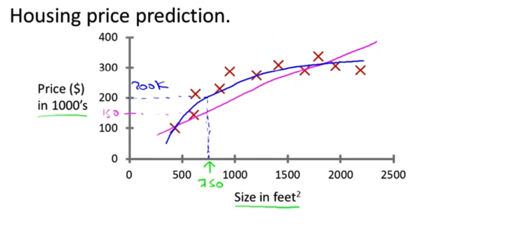
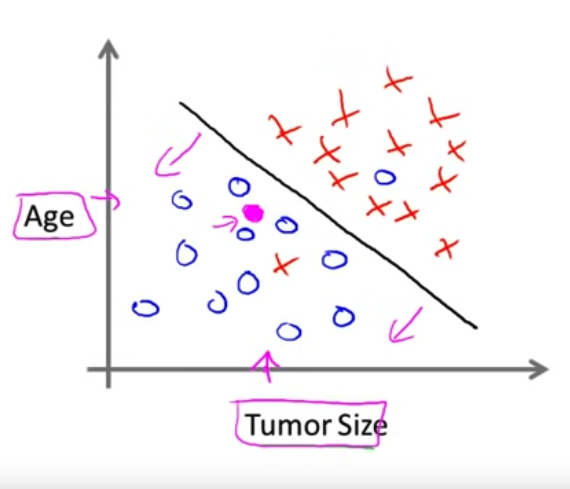

## Supervised Learning
"Right answers given". i.e. **depending on the dataset**, the algorithm type is going to give you the right answers.

> In this example we are trying to predict a house price keeping in mind the Square feets (size) and the price (money).

1. Use Case 1: Housing price predictions

>This is also called a **Regression problem** because you try to predict continuous valued output (price)

___
2. Second use case: Breast Cancer definition with the tumor size
> In this case the clasification has a discrete valued output (0, 1) given by a single attribute (tumor size) however other factors can have influence (for example the age)

> Here we can see a trend 

## Features for machine learning problems
- Clump Thickness
- Uniformity of cell size
- Uniformity of cell shape
- So on...

### Practice problem
You are running a company, and you want to develop learning algorithms to address each of two problems

**Problem 1:** You have a large inventory of identical items. You want to predict how many of these items will sell over the next 3 months.
> A regression problem because we can have __thousands of values__ and what we want to get is a **continuous value**

**Problem 2:** You'd like software to examine individual customer accounts, and for each account decide if it has been hacked/compromised
> A classification problem because we need to examine each individual account with clasifying in 0 -> Not hacked, 1-> Hacked/compromised

## Main question
__Should you treat these as classification or as regression problems?__
- [ ] Treat both as classification problems.
- [ ] Treat problem 1 as a clasification problem, problem 2 as a regression problem.
- [x] Treat problem 1 as a regression problem, problem 2 as a classification problem.
- [ ] Treat both as regression problems. 