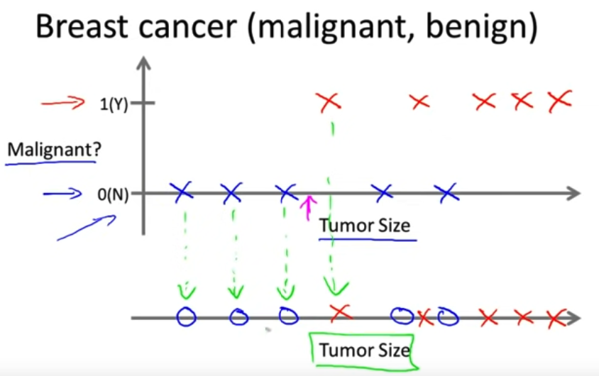

## Supervised Learning
"Right answers given". i.e. **depending on the dataset**, the algorithm type is going to give you the right answers.

> In this example we are trying to predict a house price keeping in mind the Square feets (size) and the price (money).

>This is also called a **Regression problem** because you try to predict continuous valued output (price)

1. Use Case 1: Housing price predictions

2. Use Case 2: Breast Cancer definition with the tumor size
> In this case the clasification has a discrete valued output (0, 1) given by a single attribute (size)

### Commonly found use cases
- Price Prediction
- Features definition